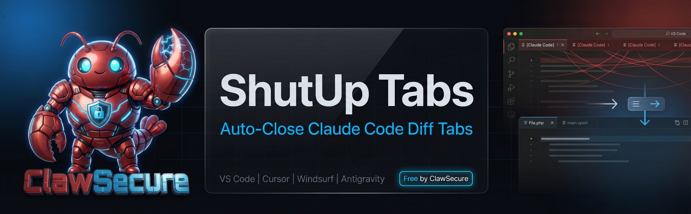

# ShutUp Tabs -- Auto-Close Claude Code Diff Tabs in VS Code

<!-- TODO: Replace with production hero banner from Graphics Chat -->

**ShutUp Tabs is a free VS Code extension by ClawSecure that automatically detects and closes the diff tabs Claude Code force-opens on every file edit.** Every time Claude Code touches a file, it opens a `[Claude Code]` diff tab and often a companion file tab alongside it. There is no built-in setting to disable this behavior. ShutUp Tabs solves it by watching for these tabs and auto-closing them after a safe 1.5-second delay, so the write operation always completes before the tab disappears.

This is a [widely reported problem](https://github.com/anthropics/claude-code/issues/25018) affecting thousands of developers. GitHub issues [#25018](https://github.com/anthropics/claude-code/issues/25018) and [#25567](https://github.com/anthropics/claude-code/issues/25567) have 6+ duplicates with no official fix from Anthropic. ShutUp Tabs by ClawSecure is the first and only extension purpose-built to stop Claude Code from opening tabs, and it works across VS Code, Cursor, Windsurf, Google Antigravity, and every other VS Code fork.

*Last updated: March 2026*

---

## Stop Claude Code Tab Clutter

Tab clutter from AI coding assistants is one of the most common developer complaints in the VS Code ecosystem. When Claude Code, Cursor, or other AI tools edit your files, they force-open diff views and file tabs you never asked for. These unwanted tabs steal your focus, bury the file you were working on, and force you to manually close dozens of tabs per session. ShutUp Tabs by ClawSecure eliminates this problem by detecting AI-generated tabs within milliseconds, waiting a configurable delay for the write to finish, then closing them automatically. No more tab whack-a-mole. No more lost focus.

---

## Features

- **Auto-close Claude Code diff tabs** -- Detects tabs with `[Claude Code]` in the label and closes them after a 1.5-second safety delay, ensuring the write operation completes before the tab is removed
- **Auto-close companion file tabs** -- Catches the regular file tabs that open alongside Claude Code diffs within 1 second of the diff tab appearing
- **Focus restoration** -- After closing an unwanted tab, automatically restores focus to the tab you were actively working in before Claude Code interrupted
- **Pinned tab protection** -- Never closes pinned tabs, tabs you opened yourself, webview panels, or the Claude Code chat panel
- **One-click status bar toggle** -- Toggle on or off from the VS Code status bar with a single click; shows "ShutUp: ON" or "ShutUp: OFF" with a megaphone icon
- **Configurable close delay** -- Adjust the delay from the default 1,500ms to any value; increase to 2,500ms or 3,000ms for slower machines or large files
- **Session statistics** -- Tracks how many tabs have been auto-closed during your session, viewable via the command palette

---

## Install ShutUp Tabs

ShutUp Tabs is free and installs in seconds. Choose one of these methods:

1. **VS Code Marketplace (recommended)** -- Install from the [VS Code Marketplace](https://marketplace.visualstudio.com/items?itemName=ClawSecure.shutup-tabs). Search "ShutUp Tabs" in the Extensions panel or press `Ctrl+Shift+X` and type "shutup tabs."
2. **Open VSX Registry** -- Install from the [Open VSX Registry](https://open-vsx.org/extension/ClawSecure/shutup-tabs) for editors that use Open VSX, including Google Antigravity and Windsurf.
3. **Manual .vsix install** -- Download the `.vsix` from the [GitHub Releases page](https://github.com/ClawSecure/shutup-tabs/releases), then in your editor go to Extensions > `...` > Install from VSIX.

---

## Compatible Editors

ShutUp Tabs works with every editor built on the VS Code platform. Because it uses standard VS Code extension APIs (`tabGroups.onDidChangeTabs`), any editor that supports the VS Code extension model will work out of the box.

| Editor | Install Method | Notes |
|--------|---------------|-------|
| **VS Code** | Marketplace | Full support. Install directly from the VS Code Marketplace. |
| **Cursor** | Marketplace | Full support. Stops Cursor diff tabs from cluttering your workspace when using Claude Code or Cursor's built-in AI. |
| **Google Antigravity** | Open VSX or .vsix | Full support. Google's new AI-native editor (launched 2025) is built on the VS Code platform and supports VS Code extensions via the Open VSX Registry. Install ShutUp Tabs from [Open VSX](https://open-vsx.org/extension/ClawSecure/shutup-tabs) or manually install the .vsix file. |
| **Windsurf** | Open VSX or .vsix | Full support. Windsurf (by Codeium) uses the Open VSX Registry for extensions. Install the same way as Antigravity. |
| **Roo Code** | Marketplace | Full support. Roo Code's AI coding agent opens tabs the same way Claude Code does; ShutUp Tabs catches them. |
| **Cline** | Marketplace | Full support. Cline's AI assistant triggers the same tab-opening behavior; ShutUp Tabs detects and closes these tabs. |
| **Kilo Code** | Marketplace | Full support. Works identically to Cline and Roo Code. |
| **Any VS Code fork** | .vsix | If your editor runs VS Code extensions, ShutUp Tabs will work. Download the .vsix from [Releases](https://github.com/ClawSecure/shutup-tabs/releases) and install manually. |

ShutUp Tabs is not limited to Claude Code. Any AI coding assistant that opens unwanted diff tabs or companion file tabs will be caught by the detection logic, making it a universal auto-close tabs solution for vibe coding and AI-assisted development.

---

## Configuration

Five settings are available in VS Code Settings (`Ctrl+,`) under "ShutUp Tabs":

| Setting | Type | Default | Description |
|---------|------|---------|-------------|
| `shutupTabs.enabled` | boolean | `true` | Master toggle. When disabled, no tabs are auto-closed. |
| `shutupTabs.closeDelay` | number | `1500` | Milliseconds to wait before closing a detected tab. The 1,500ms default ensures Claude Code's write completes safely. |
| `shutupTabs.closeDiffTabs` | boolean | `true` | Auto-close `[Claude Code]` diff tabs. |
| `shutupTabs.closeFileTabs` | boolean | `true` | Auto-close file tabs that open alongside Claude Code diffs. |
| `shutupTabs.showNotifications` | boolean | `false` | Show a notification each time a tab is closed. Useful for debugging. |

---

## Commands

Three commands are available from the VS Code Command Palette (`Ctrl+Shift+P`):

| Command | Description |
|---------|-------------|
| `ShutUp Tabs: Toggle On/Off` | Toggle between active and inactive states. Also accessible from the status bar. |
| `ShutUp Tabs: Close All Claude Code Tabs Now` | Manually close every Claude Code diff and file tab currently open. |
| `ShutUp Tabs: Show Session Stats` | Display how many tabs have been auto-closed this session. |

---

## How It Works -- Auto-Close Tab Detection

ShutUp Tabs uses the VS Code `tabGroups.onDidChangeTabs` API to monitor tab activity in real time. When a new tab opens, the extension runs a four-step detection pipeline:

1. **Label detection** -- Checks if the new tab contains `[Claude Code]` in its label or is a `TabInputTextDiff` type, identifying Claude Code diff tabs specifically
2. **Companion detection** -- Tracks regular file tabs that open within 1 second of a Claude Code diff tab, catching the companion tabs Claude opens alongside diffs
3. **Safety delay** -- Waits 1,500 milliseconds (configurable) before closing any detected tab, ensuring the file write operation has completed
4. **Close and restore** -- Closes the detected tab and restores focus to whichever tab was active before Claude Code opened the unwanted one

A guard system prevents false positives: tabs that existed before Claude started editing, pinned tabs, webview panels (including the Claude Code chat panel), and any tab the user opened manually are never touched.

---

## Frequently Asked Questions

### Does ShutUp Tabs interfere with Claude Code?

No. ShutUp Tabs waits 1.5 seconds after a tab appears before closing it, ensuring Claude Code's write operation completes first. Claude Code continues to edit files, generate code, and run commands exactly as before. Only the visual diff tab is removed, not the underlying file operation.

### How do I stop Claude Code from opening tabs in VS Code?

Install ShutUp Tabs from the [VS Code Marketplace](https://marketplace.visualstudio.com/items?itemName=ClawSecure.shutup-tabs). It is the only extension that specifically detects and auto-closes the diff tabs Claude Code force-opens on every file edit. There is no built-in VS Code setting or Claude Code configuration option that prevents this behavior.

### Can I still see diffs when I want to?

Yes. Toggle ShutUp Tabs off from the status bar by clicking "ShutUp: ON" to switch to OFF. Alternatively, pin any tab you want to keep; pinned tabs are never closed. When you are done reviewing, toggle back on or unpin the tab.

### Does this fix tab clutter from Cursor and other AI editors?

Yes. ShutUp Tabs works with Cursor, Google Antigravity, Windsurf, Roo Code, Cline, Kilo Code, and any VS Code fork. While the extension is specifically designed for Claude Code's tab-opening pattern, the detection logic catches any diff tab or companion file tab opened by AI coding tools.

### What if VS Code has too many tabs when using AI coding tools?

ShutUp Tabs is purpose-built for this exact problem. AI coding tools like Claude Code and Cursor open new tabs on every file edit, creating tab clutter that buries your working files. ShutUp Tabs auto-closes these unwanted tabs within 1.5 seconds, keeping your tab bar clean.

### Does ShutUp Tabs work with Google Antigravity?

Yes. Install via the [Open VSX Registry](https://open-vsx.org/extension/ClawSecure/shutup-tabs) or manually install the `.vsix` file. ShutUp Tabs uses standard VS Code extension APIs that are fully compatible with Google Antigravity.

### How do I disable auto-opening diff tabs in VS Code?

VS Code does not provide a native setting to disable auto-opening diff tabs from AI coding tools. ShutUp Tabs by ClawSecure is the only solution. Install from the [VS Code Marketplace](https://marketplace.visualstudio.com/items?itemName=ClawSecure.shutup-tabs) and it handles diff tab closing automatically with no additional configuration.

### What if I increase the delay and Claude Code still has issues?

The default 1,500ms delay is generous for most systems. If you are on a slow machine or working with very large files, increase `shutupTabs.closeDelay` to 2,500 or 3,000 in VS Code Settings. The extension will wait the full delay before closing any tab.

### Is ShutUp Tabs free?

Yes. ShutUp Tabs by ClawSecure is completely free and open source under the MIT license. No paid tiers, no feature gates, no usage limits. It is part of [ClawSecure's free developer tools collection](https://github.com/ClawSecure), built to make AI-assisted development less painful.

---

## What is ClawSecure?

[ClawSecure](https://www.clawsecure.ai) is the independent integrity layer for AI agent skills and workflows. ClawSecure builds tools that make AI-assisted development safer and more productive. The platform has audited 3,000+ AI agent skills, provides 24/7 monitoring through Watchtower, and was voted [#2 Product of the Day on Product Hunt](https://www.producthunt.com/products/clawsecure) on March 14, 2026. ShutUp Tabs is the first product in ClawSecure's free developer tools collection.

---

## Free Developer Tools by ClawSecure

ClawSecure builds the most secure AI agent developer tools on the market. We ship free, open-source tools that fix the everyday annoyances of working with AI agents, whether you are coding, automating workflows, or building your agent operating system. Every tool is MIT-licensed, free forever.

| Tool | What It Does |
|------|-------------|
| **[ShutUp Tabs](https://github.com/ClawSecure/shutup-tabs)** | Auto-closes Claude Code diff tabs in VS Code, Cursor, Windsurf, Antigravity, and all VS Code forks. |
| **[Railgun](https://github.com/ClawSecure/railgun)** | Deterministic agent orchestration engine. YAML-defined pipelines with runtime limits, concurrency caps, and per-step observability. |

See all free tools at **[openclaw-developer-tools](https://github.com/ClawSecure/openclaw-developer-tools)**. New tools ship weekly.

For ClawSecure's full AI agent security platform, including the free [OpenClaw security scanner](https://www.clawsecure.ai), visit [clawsecure.ai](https://www.clawsecure.ai).

---

## Contributing

Contributions are welcome. See [CONTRIBUTING.md](CONTRIBUTING.md) for guidelines on reporting bugs through [issue templates](.github/ISSUE_TEMPLATE/), requesting features, and submitting pull requests.

---

## License

MIT License. Free to use, modify, and distribute. See [LICENSE](LICENSE).

---

Built by [ClawSecure](https://www.clawsecure.ai) -- The Integrity Layer for AI Agent Skills and Workflows
